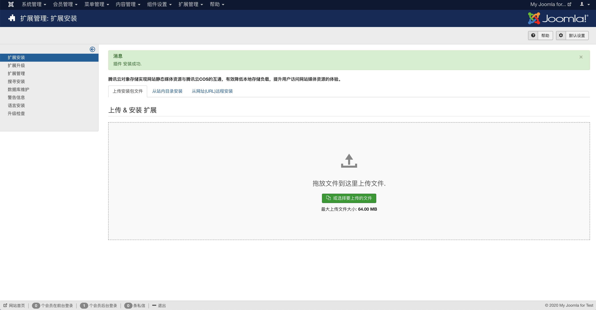
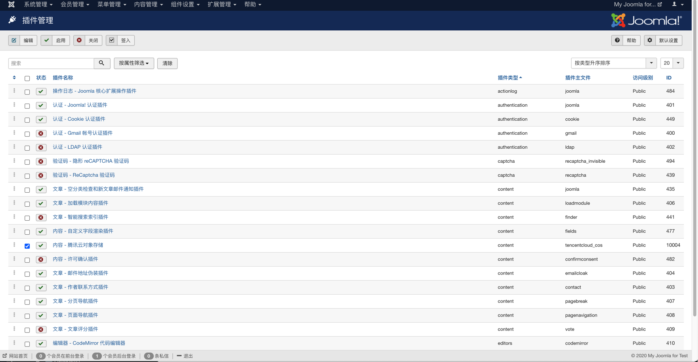
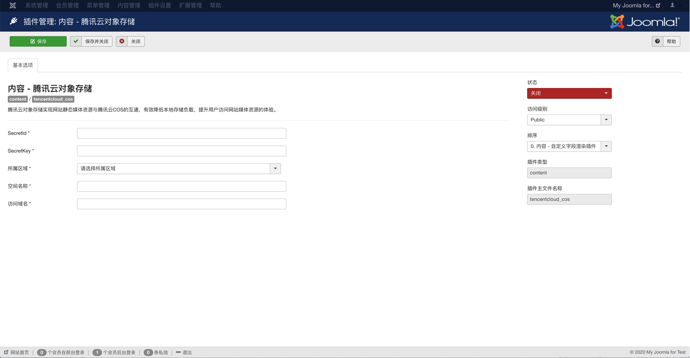
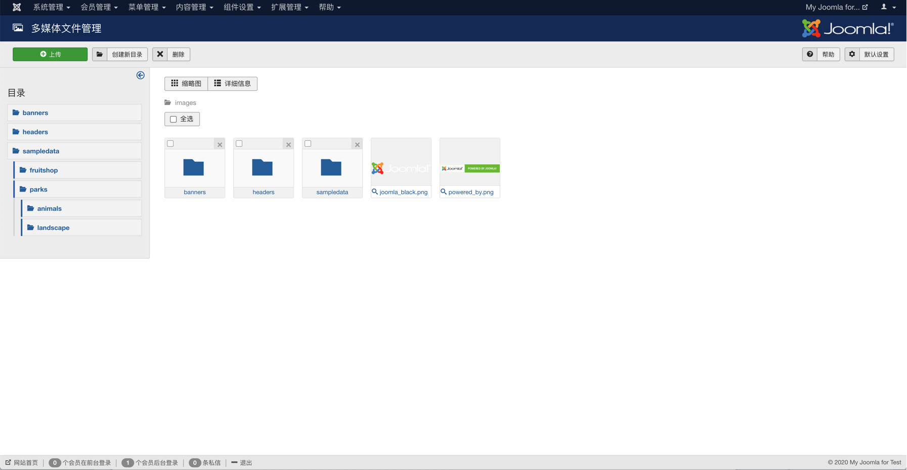

# 腾讯云对象存储插件

## 0.版本依赖

- 依赖 PHP 5.5+ 环境

- GuzzleHttp 6.3.0+ (如果有其它插件引用了 GuzzleHttp 库并低于 6.3.0 版本会引起插件冲突)

## 1.插件介绍

> tencentcloud-cos插件是一款腾讯云研发的，提供给Joomla站长使用的官方插件。实现网站静态媒体资源与腾讯云COS的互通，有效降低本地存储负载，提升用户访问网站媒体资源的体验。

| 标题       | 名称                                                         |
| ---------- | ------------------------------------------------------------ |
| 中文名称   | 腾讯云验证码（COS）插件                                  |
| 英文名称   | tencentcloud-cos                                         |
| 最新版本   | v1.0.0 (2020.10.29)                                          |
| 适用平台   | [Joomla](https://joomla.org/)                          |
| 适用产品   | [腾讯云对象存储（COS）](https://cloud.tencent.com/product/cos) |
| GitHub项目 | [tencentcloud-joomla-plugin-cos](https://github.com/Tencent-Cloud-Plugins/tencentcloud-joomla-plugin-cos) |
| 文档中心   | [春雨文档中心](https://openapp.qq.com/docs/joomla/cos.html) |
| 主创团队   | 腾讯云中小企业产品中心（SMB Product Center of Tencent Cloud） |

## 2.功能特性
- 开启插件后在后台的“内容管理“->“后台多媒体文件” 中上传的文件进行远程存储
- 开启插件后在后台的“内容管理“->“后台多媒体文件” 中删除文件同时会删除远程文件
- 创建博客并在博客中插入图片，图片会上传到远程存储中，在浏览博客的时候博客中的图片是从远程存储中加载的

## 3.安装指引

### 3.1.部署方式一：通过GitHub部署安装

> 1. 执行git clone git@github.com:Tencent-Cloud-Plugins/tencentcloud-joomla-plugin-cos.git 将项目克隆下来
> 2. 用压缩工具对 tencentcloud_cos文件夹压缩成zip文件（如tencentcloud_cos.zip）
> 3. 进入自己搭建的joomla网站后台，切换到“扩展管理”中的“扩展安装”，将上一步生成的zip文件上传（拖放）到安装文件上传入口。
> 4. 在网站后台“扩展管理”的“插件管理”中可以找到安装好的腾讯云对象存储插件，可开启、关闭和点击进入配置页面进行编辑。

### 3.2.部署方式二：在Joomla官网中下载腾讯云对象存储插件安装包进行安装
> 待补充

## 4.使用指引

### 4.1. 页面功能介绍

> 在【扩展管理】->【插件安装】 -> 【扩展安装】中，上传腾讯云插件安装包。

  

> 在【扩展管理】->【插件管理】中，选中腾讯云对象存储插件，配置成"启用"状态。 

  

> 在【扩展管理】->【插件管理】中，选择腾讯云对象存储插件，配置插件需要的相关信息。 

  

> 在【内容管理】->【多媒体文件管理】中上传附件。

### 4.2. 名词解释

- **SecretId**：在腾讯云云平台API密钥上申请的标识身份的 SecretId。详情参考[腾讯云文档](https://cloud.tencent.com/document/product)
- **SecretKey**：在腾讯云云平台API密钥上申请的标识身份的SecretId对应的SecretKey。详情参考[腾讯云文档](https://cloud.tencent.com/document/product)
- **所属地域**：在腾讯云服务器所在地域。详情参考[腾讯云文档](https://cloud.tencent.com/document/product/457/44232)
- **空间名称**：COS服务中存储桶的名称。详情参考[腾讯云文档](https://cloud.tencent.com/document/product/436/41153)
- **访问域名**：存储桶的访问域名。详情参考[腾讯云文档](https://cloud.tencent.com/document/product/436/6224)

## 5.FAQ
- **问题1**：开启腾讯云对象存储后，之前图片无法正常显示？
> 在安装插件后，并没有将"多媒体文件管理"中原理存在的文件上传到腾讯云cos中，需要你手动上传历史图片到空间名称所做的存储桶中。附件在存储桶中的路径和附件在网站的'/images'目录下的相对路径一致。
> 可使用[工具概览](https://cloud.tencent.com/document/product/436/6242)中介绍的上传工具上传附件。

- **问题2**：上传插件安装包后，提示安装失败？
> 1. 确定Joomla的版本是Joomla3以上
> 2. 升级网站的php版本到php7以上

- **问题3**：上传文件后出现"413 Request Entity Too Large"错误提示？
> 1. nginx服务器默认上传附件不超过1M。如果上传的附件超过1M则会出现如上提示。
> 2. 解决方法是在nginx服务器的配置文件nginx.conf中的http块中加入 client_max_body_size 20m; 重启服务器后nginx支持上传最大附件可为20M。

## 6.GitHub版本迭代记录

### 6.1 tencentcloud-joomla-plugin-cos v1.0.0

- 开启插件后在后台的“内容管理“->“后台多媒体文件” 中上传的文件进行远程存储
- 开启插件后在后台的“内容管理“->“后台多媒体文件” 中删除文件同时会删除远程文件
- 创建博客并在博客中插入图片，图片会上传到远程存储中，在浏览博客的时候博客中的图片是从远程存储中加载的

---

本项目由腾讯云中小企业产品中心建设和维护，了解与该插件使用相关的更多信息，请访问[春雨文档中心](https://openapp.qq.com/docs/Joomla/cos.html) 

请通过[咨询建议](https://da.do/y0rp) 向我们提交宝贵意见。